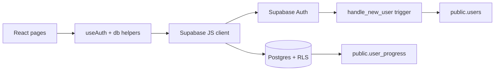

# PromptLabz

PromptLabz ajuda estudantes e criadores iniciantes a praticar prompts e habilidades de IA sem depender de aulas soltas ou progresso manual.

## Funcionalidades

- Autenticacao com Supabase: email/senha, reset de senha, Google OAuth e Apple OAuth.
- Rotas protegidas para home, trilhas, licoes, skills, missao e perfil.
- Progresso por categoria salvo em `localStorage` e sincronizado em Supabase.
- Perfil do usuario em `public.users`, criado automaticamente por trigger.
- Base preparada para premium com status e IDs Stripe protegidos contra update pelo cliente.

## Stack

- React + Vite: UI SPA rapida e simples de hospedar.
- TypeScript: contratos claros entre telas, hooks e camada de dados.
- Supabase Auth + Postgres: backend gerenciado com RLS.
- Vitest + Testing Library: testes unitarios e de fluxo de UI.
- ESLint + GitHub Actions: validacao automatica em PR/push.

## Arquitetura



## Backend

- `supabase/migrations/20260610_000_initial_schema.sql`: tabelas `users` e `user_progress`, RLS, triggers e checks.
- `supabase/migrations/20260610_001_users_premium.sql`: campos premium, constraint idempotente e indexes Stripe.
- `supabase/seed.sql`: placeholder documentando que cursos ainda ficam em `src/data`.
- `src/lib/supabase.ts`: cliente Supabase, falha explicita sem env fora de teste.
- `src/lib/db.ts`: camada de perfil/progresso com colunas explicitas.
- `supabase/functions/send-auth-email/index.ts`: hook de email do Supabase Auth com template HTML proprio, mascote e remetente do app via Resend.

## Como Rodar

```bash
pnpm install
cp .env.example .env.local
pnpm dev
```

Preencha `.env.local`:

```bash
VITE_SUPABASE_URL=...
VITE_SUPABASE_ANON_KEY=...
APP_URL=...
APP_NAME=PromptLabz
RESEND_FROM_EMAIL=no-reply@seudominio.com
RESEND_API_KEY=...
SEND_EMAIL_HOOK_SECRET=...
```

Para Supabase local:

```bash
supabase start
supabase db reset
```

Depois copie URL e anon key exibidas pelo CLI para `.env.local`.

## Validacao

```bash
pnpm typecheck
pnpm lint
pnpm test
pnpm build
pnpm smoke:supabase
```

`pnpm smoke:supabase` valida envs e conectividade quando credenciais reais existem. Sem envs, pula sem falhar para permitir CI de PR sem segredos.

## Deploy

1. Configure `VITE_SUPABASE_URL` e `VITE_SUPABASE_ANON_KEY`.
2. Rode migrations no Supabase antes do deploy.
3. Cadastre URLs de redirect no Supabase Auth: `/login`, `/reset-password` e `/home`.
4. Ative providers Google e Apple no Supabase Auth. Apple exige Service ID, Team ID, Key ID e private key configurados no painel da Apple Developer.
5. Configure envio de email com remetente do app:
   - Verifique dominio no Resend.
   - Defina `RESEND_FROM_EMAIL` com email do seu dominio.
   - Deploy: `supabase functions deploy send-auth-email --no-verify-jwt`
   - Secrets: `supabase secrets set --env-file .env.local`
   - Dashboard Supabase > Auth > Hooks > Send Email Hook > HTTPS > URL da function > Generate Secret.
6. Rode `pnpm build`.

## Email de confirmacao personalizado

- Template usa `public/assets/mascot-login-new.png` servido por `APP_URL`.
- Remetente sai como `${APP_NAME} <${RESEND_FROM_EMAIL}>`, nao como endereco padrao do Supabase.
- Hook cobre `signup`, `recovery`, `magiclink` e `email_change`, com foco principal em confirmacao de cadastro.

## Decisoes

- Supabase foi escolhido para entregar Auth + Postgres + RLS sem manter servidor proprio.
- Cursos continuam em `src/data` por enquanto para manter MVP rapido; se virarem conteudo editavel, devem migrar para tabelas com seeds.
- Campos premium ficam em `public.users` por compatibilidade, mas update do cliente foi restringido por grants. Proximo passo ideal: tabela privada `billing_profiles`.

## Roadmap

- Criar testes de integracao com Supabase local para RLS e migrations.
- Adicionar demo user/seed quando conteudo sair do front.
- Integrar Sentry ou Logtail para erros de producao.
- Implementar webhook Stripe via Edge Function.
- Publicar URL demo com screenshots/GIF curto.

