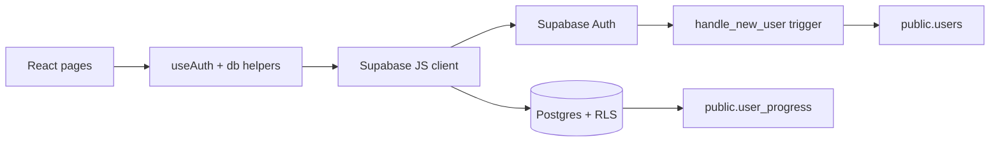

# PromptLabz

Documento de projeto consolidado em 2026-06-10 a partir de `README.md`, `AUTH_TODO.md`, `BACKEND_TODO.md` e docs locais. Busca no Mem por notas relacionadas a PromptLabz, Supabase, Stripe, Auth e comunidade nao retornou resultados relevantes.

## Resumo

PromptLabz ajuda estudantes e criadores iniciantes a praticar prompts e habilidades de IA sem depender de aulas soltas ou progresso manual.

## Funcionalidades

- Autenticacao com Supabase: email/senha, reset de senha, Google OAuth e Apple OAuth.
- Rotas protegidas para home, trilhas, licoes, skills, missao e perfil.
- Progresso por categoria salvo em `localStorage` e sincronizado em Supabase.
- Perfil do usuario em `public.users`, criado automaticamente por trigger.
- Base preparada para premium com status e IDs Stripe protegidos contra update pelo cliente.

## Stack

- React + Vite: UI SPA rapida e simples de hospedar.
- TypeScript: contratos claros entre telas, hooks e camada de dados.
- Supabase Auth + Postgres: backend gerenciado com RLS.
- Vitest + Testing Library: testes unitarios e de fluxo de UI.
- ESLint + GitHub Actions: validacao automatica em PR/push.

## Arquitetura



## Backend

- `supabase/migrations/20260610_000_initial_schema.sql`: tabelas `users` e `user_progress`, RLS, triggers e checks.
- `supabase/migrations/20260610_001_users_premium.sql`: campos premium, constraint idempotente e indexes Stripe.
- `supabase/seed.sql`: placeholder documentando que cursos ainda ficam em `src/data`.
- `src/lib/supabase.ts`: cliente Supabase, falha explicita sem env fora de teste.
- `src/lib/db.ts`: camada de perfil/progresso com colunas explicitas.

## Como Rodar

```bash
pnpm install
cp .env.example .env.local
pnpm dev
```

Preencher `.env.local`:

```bash
VITE_SUPABASE_URL=...
VITE_SUPABASE_ANON_KEY=...
```

Para Supabase local:

```bash
supabase start
supabase db reset
```

Depois copiar URL e anon key exibidas pelo CLI para `.env.local`.

## Validacao

```bash
pnpm typecheck
pnpm lint
pnpm test
pnpm build
pnpm smoke:supabase
```

`pnpm smoke:supabase` valida envs e conectividade quando credenciais reais existem. Sem envs, pula sem falhar para permitir CI de PR sem segredos.

## Deploy

1. Configure `VITE_SUPABASE_URL` e `VITE_SUPABASE_ANON_KEY`.
2. Rode migrations no Supabase antes do deploy.
3. Cadastre URLs de redirect no Supabase Auth: `/login`, `/reset-password` e `/home`.
4. Ative providers Google e Apple no Supabase Auth. Apple exige Service ID, Team ID, Key ID e private key configurados no painel da Apple Developer.
5. Rode `pnpm build`.

## Decisoes

- Supabase foi escolhido para entregar Auth + Postgres + RLS sem manter servidor proprio.
- Cursos continuam em `src/data` por enquanto para manter MVP rapido; se virarem conteudo editavel, devem migrar para tabelas com seeds.
- Campos premium ficam em `public.users` por compatibilidade, mas update do cliente foi restringido por grants. Proximo passo ideal: tabela privada `billing_profiles`.

## Roadmap do README

- [ ] Criar testes de integracao com Supabase local para RLS e migrations.
- [ ] Adicionar demo user/seed quando conteudo sair do front.
- [ ] Integrar Sentry ou Logtail para erros de producao.
- [ ] Implementar webhook Stripe via Edge Function.
- [ ] Publicar URL demo com screenshots/GIF curto.

## To-do Pendentes Consolidados

### Ja concluido

- [x] Trocar Firebase por Supabase SDK.
- [x] Criar `AuthContext` para estado global de autenticacao.
- [x] Criar hook `useAuth` com login, signup, logout, reset de senha e OAuth Google.
- [x] Criar `PrivateRoute` para protecao de rotas.
- [x] Integrar Login com email/senha.
- [x] Criar Signup com validacao de formulario.
- [x] Criar ForgotPassword com envio de reset.
- [x] Adicionar tratamento de erro e loading states no fluxo de auth.
- [x] Atualizar `tsconfig` para `import.meta.env`.
- [x] Validar formato de email.
- [x] Validar forca de senha.
- [x] Confirmar senhas iguais.
- [x] Criar pagina de reset de senha.
- [x] Atualizar senha com token.
- [x] Mostrar mensagens de sucesso/erro no reset.
- [x] Redirecionar para login apos reset.
- [x] Testar fluxo Google login na UI.
- [x] Exibir nome do usuario no header da Home.
- [x] Exibir avatar no header.
- [x] Criar/usar pagina de perfil em `/profile`.
- [x] Adicionar botao de logout no header.
- [x] Bloquear usuarios anonimos em rotas protegidas.
- [x] Redirecionar anonimos para `/login`.
- [x] Redirecionar usuarios autenticados de `/login` e `/signup` para `/home`.
- [x] Manter usuario autenticado em `/forgot-password`.
- [x] Bloquear autopromocao premium via RLS/grants.
- [x] Corrigir fluxo de reset de senha para `/reset-password`.
- [x] Remover fallback silencioso de credenciais Supabase fora de teste.
- [x] Criar migration inicial versionada.
- [x] Tornar constraint premium idempotente.
- [x] Fixar `search_path` em funcoes SQL.
- [x] Adicionar `WITH CHECK` explicito em policies de update.
- [x] Adicionar constraints de validade em `user_progress`.
- [x] Indexar campos Stripe.
- [x] Mover `updated_at` para trigger no banco.
- [x] Persistir `full_name` no signup.
- [x] Unificar perfil em `public.users`.
- [x] Evitar `SELECT *` em dados de perfil/progresso.
- [x] Tratar erro de sessao no `AuthProvider`.
- [x] Configurar redirect OAuth para `/home`.
- [x] Ativar login/cadastro com Google e Apple na UI.
- [x] Propagar erros da camada `db`.
- [x] Criar CI em `.github/workflows/ci.yml`.
- [x] Padronizar scripts sem install embutido.
- [x] Padronizar lockfile em `pnpm-lock.yaml`.
- [x] Adicionar comando `pnpm check`.
- [x] Documentar setup completo de backend no README.
- [x] Adicionar seed placeholder em `supabase/seed.sql`.
- [x] Criar health/smoke check em `scripts/smoke-supabase.mjs`.
- [x] Atualizar README de recrutador.
- [x] Validar `typecheck`, `lint`, `test`, `build` e `smoke:supabase`.

### Backend e ambiente real

- [ ] Configurar Google provider no Supabase Dashboard.
- [ ] Configurar Apple provider no Supabase Dashboard e Apple Developer.
- [ ] Rodar migrations contra ambiente Supabase real.
- [ ] Preencher envs reais no deploy.
- [ ] Criar testes de integracao contra Supabase local/CI com Docker disponivel.
- [ ] Integrar Sentry/Logtail se quiser observabilidade externa.

### Auth e validacao

Observacao: `AUTH_TODO.md` parece mais antigo que `BACKEND_TODO.md`; itens abaixo devem ser revisados antes de executar, pois parte do backend e RLS ja foi concluida em migrations.

- [ ] Criar projeto Supabase real em `https://supabase.com`.
- [ ] Copiar credenciais para `.env.local`.
- [ ] Ativar Email/Password no Supabase Auth.
- [ ] Ativar Google OAuth no Supabase.
- [ ] Testar login/signup em dev com credenciais reais.
- [ ] Testar navegacao para `/home` apos login.
- [ ] Checar email ja registrado antes/depois do signup e tratar erro de duplicidade.
- [ ] Enviar email de verificacao apos signup.
- [ ] Testar fluxo signup -> verificacao de email -> login.
- [ ] Testar envio de email de reset de senha.
- [ ] Validar token de reset.
- [ ] Configurar Apple Sign-In no Supabase.
- [ ] Testar login Apple.
- [ ] Garantir criacao automatica de perfil em signup social.
- [ ] Avaliar link de conta social com conta existente.
- [ ] Upload de avatar para Supabase Storage.
- [ ] Revisar comportamento de sessao expirada e refresh token.
- [ ] Mostrar loading state no startup do app.

### Email, UX e seguranca

- [ ] Criar pagina `/verify-email`.
- [ ] Marcar email como verificado no perfil.
- [ ] Avaliar bloqueio de login ate email verificado.
- [ ] Adicionar botao para reenviar email de verificacao.
- [ ] Avaliar limpeza de contas nao verificadas apos 7 dias.
- [ ] Melhorar mensagens para erro de rede, email ja cadastrado, senha invalida, link expirado e email nao verificado.
- [ ] Adicionar toasts de sucesso com `sonner`.
- [ ] Debounce em submits de formulario.
- [ ] Mostrar indicador de forca de senha.
- [ ] Adicionar toggle de visibilidade da senha.
- [ ] Validar inputs sensiveis server-side via Supabase Functions quando necessario.
- [ ] Adicionar rate limit em login/rotas criticas.
- [ ] Confirmar HTTPS-only em producao.

### Testes e qualidade

- [ ] Criar testes de integracao para login/signup/logout.
- [ ] Criar E2E com Playwright para login, signup, reset de senha, rotas protegidas e social login.
- [ ] Testar cenarios de erro.
- [ ] Testar em diferentes dispositivos/browsers.
- [ ] Remover `console.log` antes de producao.
- [ ] Otimizar bundle size.
- [ ] Adicionar loading skeletons.
- [ ] Adicionar animacoes para mudancas de auth state.
- [ ] Criar onboarding apos signup.
- [ ] Auditar responsividade mobile.
- [ ] Auditar acessibilidade WCAG 2.1.
- [ ] Adicionar analytics se fizer sentido.

### Comunidade premium

Baseado em `docs/superpowers/specs/2026-06-10-community-premium-design.md` e `docs/superpowers/plans/2026-06-10-community-premium.md`.

- [ ] Finalizar Stripe webhook via Edge Function.
- [ ] Criar Stripe Customer Portal via Edge Function.
- [ ] Criar RSS fetcher com cron diario e resumo Claude.
- [ ] Criar hook `useSubscription`.
- [ ] Criar `PremiumGate`.
- [ ] Criar `DailyTip`.
- [ ] Criar `NewsCard`.
- [ ] Criar `TemplateCard`.
- [ ] Criar pagina `/community`.
- [ ] Adicionar rota `/community` em `src/App.tsx`.
- [ ] Adicionar card/nav de Comunidade em `src/pages/Home.tsx`.
- [ ] Adicionar envs premium em `.env.example`.
- [ ] Configurar secrets Stripe/Anthropic no Supabase.
- [ ] Registrar webhook no Stripe Dashboard.
- [ ] Configurar cron do RSS no Supabase Dashboard.

## Fontes Locais

- `README.md`
- `AUTH_TODO.md`
- `BACKEND_TODO.md`
- `docs/superpowers/specs/2026-06-10-community-premium-design.md`
- `docs/superpowers/plans/2026-06-10-community-premium.md`

